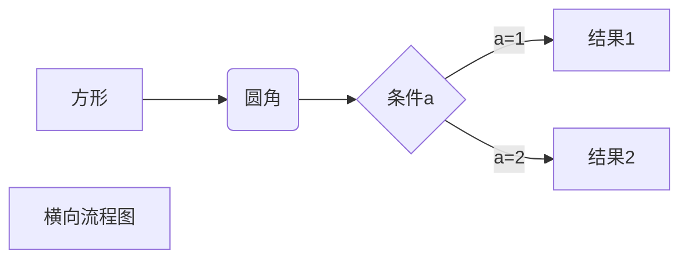
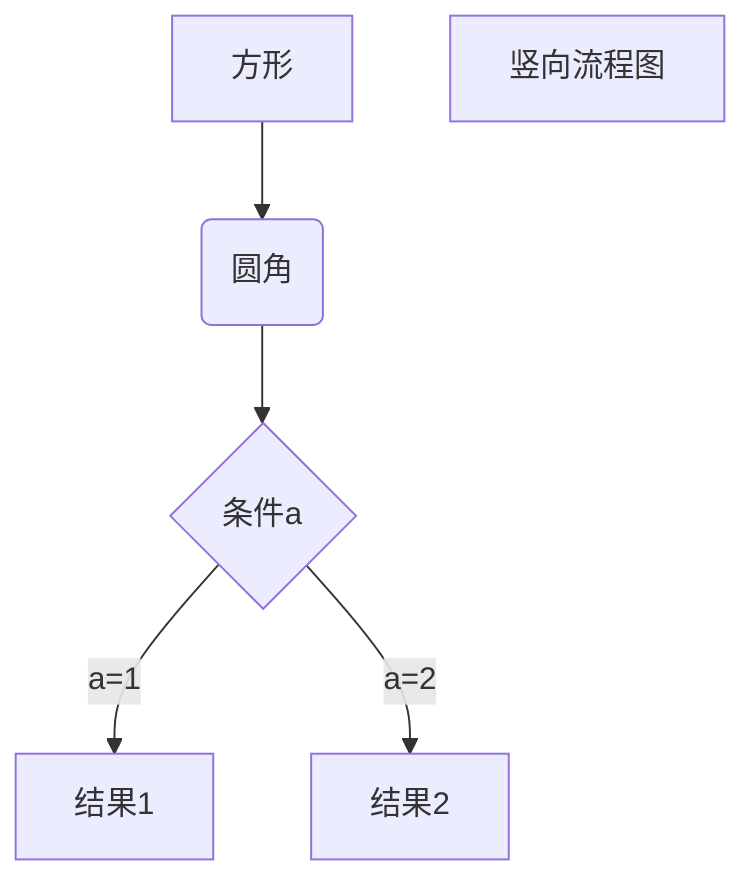
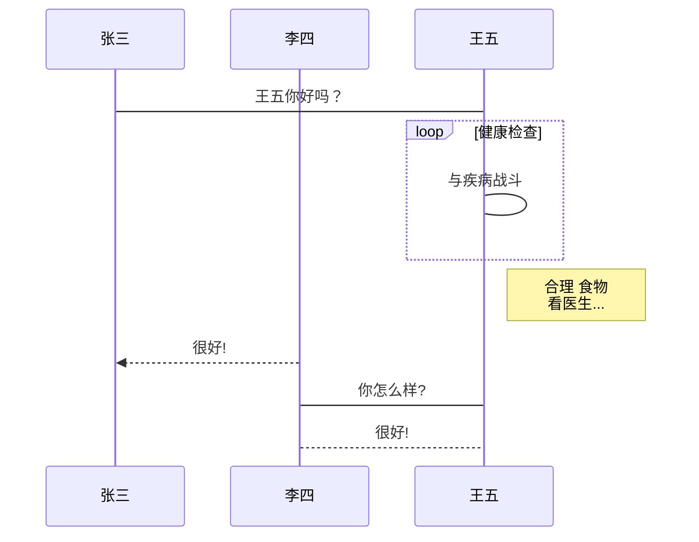
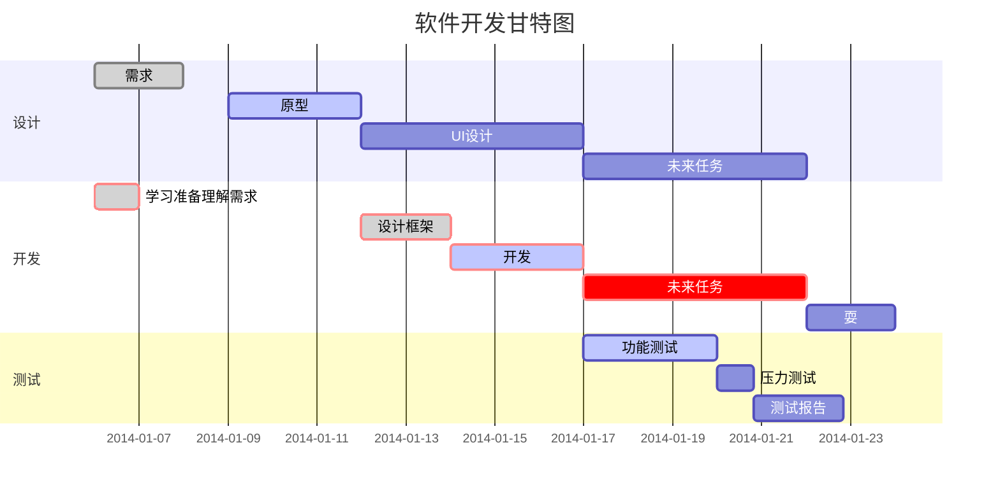

title: Markdown基本语法
author: l1n6yun
tags:
  - markdown
categories: []
date: 2022-03-11 00:00:00
---
## 简介

> Markdown是一种轻量级标记语言，创始人为约翰·格鲁伯。 它允许人们使用易读易写的**纯文本格式**编写文档，然后转换成有效的**HTML**文档。这种语言吸收了很多在电子邮件中已有的纯文本标记的特性。
>
> 由于Markdown的轻量化、易读易写特性，并且对于图片，图表、数学式都有支持，许多网站都广泛使用Markdown来撰写帮助文档或是用于论坛上发表消息。 

### 特点

- 轻量化
- 跨平台
- 易读易写

### 文件后缀名

- .md
- .markdown

## Markdown语法

### 文字样式

| 描述 | 代码         | 效果             |
| ---- | ------------ | ---------------- |
| 斜体 | \*斜体\*<br>\_斜体\_ | *斜体*<br>_斜体_ |
| 粗体 | \*\*粗体\*\* | **粗体** |
| 斜粗体 | \*\*\*斜粗体\*\*\* | ***斜粗体*** |
| 删除线 | \~\~删除线\~\~ | ~~删除线~~ |
| 插入链接 | \[链接名称](链接地址 "标题") | [链接名称](链接地址 "标题") |
| 插入图片 | \!\[alt](图片地址 "标题") |  |
| 代码行 | \`print()\` | `print()` |
| HTML 元素 | \<kbd> \<b> \<i> \<em> \<sup> \<sub> | 使用 <kbd>Ctrl</kbd>+<kbd>C</kbd> 复制 |
| emoji | :hammer: | :hammer: |


### 标题

```mark
一级标题
======

二级标题
-------

# 一级标题
## 二级标题
### 三级标题
#### 四级标题
##### 五级标题
###### 六级标题
```

### 有序列表

```markdown
1. 列表条目1
2. 列表条目2
   1. 列表条目2.1
      1. 列表条目2.1.1
      2. 列表条目2.1.2
3. 列表条目2.2
4. 列表条目3
```

1. 列表条目1
2. 列表条目2
   1. 列表条目2.1
   2. 列表条目2.2
      1. 列表条目2.2.1
      2. 列表条目2.2.2
      3. 列表条目2.2.3
   3. 列表条目2.3
3. 列表条目3

### 无需列表

```markdown
- 列表条目1
- 列表条目2
  - 列表条目2.1
    - 列表条目2.1.1
    - 列表条目2.1.2
  - 列表条目2.2
- 列表条目3
```

- 列表条目1
- 列表条目2
  - 列表条目2.1
    - 列表条目2.1.1
    - 列表条目2.1.2
  - 列表条目2.2
- 列表条目3

### 代码块

````markdown
```[语言]
代码块
```
````

```php
echo ("hello,world");
```

### 引用

```markdown
> 引用内容
>> 引用内容
```

> 引用内容
>
> > 引用内容

### 分割线

```markdown
***
* * *
*****
- - -
----------
```

***
* * *
*****
- - -
----------

### 表格

| 左对齐 | 右对齐 | 居中对齐 |
| :-----| :----: | ----: |
| 单元格 | 单元格 | 单元格 |
| 单元格 | 单元格 | 单元格 |

### 大纲

[toc]

### 公式

$$
f(x)=sin(x)+12
$$


$$
\begin{Bmatrix}
   a & b \\
   c & d
\end{Bmatrix}
$$

$$
\begin{CD}
   A @>a>> B \\
@VbVV @AAcA \\
   C @= D
\end{CD}
$$

### 流程图、时序图、甘特图

1、横向流程图源码格式：



2、竖向流程图源码格式：



3、标准流程图源码格式：

```flow
st=>start: 开始框
op=>operation: 处理框
cond=>condition: 判断框(是或否?)
sub1=>subroutine: 子流程
io=>inputoutput: 输入输出框
e=>end: 结束框
st->op->cond
cond(yes)->io->e
cond(no)->sub1(right)->op
```

4、标准流程图源码格式（横向）：

```flow
st=>start: 开始框
op=>operation: 处理框
cond=>condition: 判断框(是或否?)
sub1=>subroutine: 子流程
io=>inputoutput: 输入输出框
e=>end: 结束框
st(right)->op(right)->cond
cond(yes)->io(bottom)->e
cond(no)->sub1(right)->op
```

5、UML时序图源码样例：

```sequence
对象A->对象B: 对象B你好吗?（请求）
Note right of 对象B: 对象B的描述
Note left of 对象A: 对象A的描述(提示)
对象B-->对象A: 我很好(响应)
对象A->对象B: 你真的好吗？
```

6、UML时序图源码复杂样例：

```sequence
Title: 标题：复杂使用
对象A->对象B: 对象B你好吗?（请求）
Note right of 对象B: 对象B的描述
Note left of 对象A: 对象A的描述(提示)
对象B-->对象A: 我很好(响应)
对象B->小三: 你好吗
小三-->>对象A: 对象B找我了
对象A->对象B: 你真的好吗？
Note over 小三,对象B: 我们是朋友
participant C
Note right of C: 没人陪我玩
```

7、UML标准时序图样例：



8、甘特图样例：


